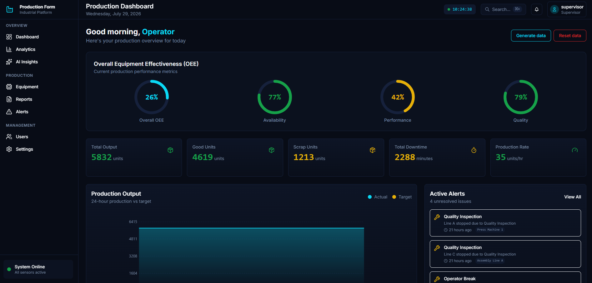

# Linea

Industrial production line monitoring dashboard, originally built as the software side of my
embedded systems master's dissertation. The thesis modeled an embedded telemetry pipeline for a
factory production line in software.



## Tech Stack

**Backend:** ASP.NET Core (.NET 10) · Clean Architecture · EF Core · SQLite · JWT Auth · BCrypt
<br>
**Frontend:** Angular 21 · TypeScript · RxJS · Tailwind CSS · Lucide Icons
<br>
**AI:** OpenAI (gpt-4o-mini) for the natural-language insights assistant

## Features

- Real-time-style dashboard: OEE, availability, performance, and quality gauges
- Production analytics: trends, efficiency over time, defect distribution
- Equipment monitoring: per-machine status, production rate, efficiency
- Alerts for active and historical downtimes
- CSV report generation, filterable by date, shift, line, and equipment
- Equipment management (add/configure machines)
- JWT authentication with role-based access control (Operator / Engineer / Supervisor)
- AI Insights assistant - ask questions about production data in plain language
- Telemetry data generator that simulates the embedded sensor stream (production counts,
  defects, downtimes) for demo and development

## Architecture

```
Linea/
├── Linea/
│   ├── Linea.Api               # Controllers, Program.cs, JWT config
│   ├── Linea.Application       # DTOs, service interfaces
│   ├── Linea.Domain             # Entities, enums
│   └── Linea.Infrastructure     # EF Core, services (auth, reports, insights, telemetry)
├── LineaUI/
│   └── src/app/
│       ├── pages/                # Dashboard, Analytics, Equipment, Reports, Alerts, Users, Settings
│       └── shared/                # Services, guards, interceptors, utils
├── docs/
├── README.md
└── Linea/Linea.slnx
```

## Getting Started

### Backend

```bash
cd Linea
dotnet user-secrets set "Jwt:Key" "a-long-random-development-secret" --project Linea.Api
dotnet run --project Linea.Api/Linea.Api.csproj
```

Runs on `http://localhost:5203` (Swagger UI at `/swagger`). SQLite database and migrations are
applied automatically on startup, and default users are seeded on first run (see below). No
external database needed.

### Frontend

```bash
cd LineaUI
npm install
npm start
```

Runs on `http://localhost:4200` and proxies `/api` requests to the backend (see
`LineaUI/proxy.conf.json`).

### Default users (seeded on first run)

| Username     | Password       | Role       |
| ------------ | -------------- | ---------- |
| operator     | operator123    | Operator   |
| engineer     | engineer123    | Engineer   |
| supervisor   | supervisor123  | Supervisor |

### AI Insights (optional)

The AI Insights page calls OpenAI's Chat Completions API. Without a key it degrades gracefully
with a "not configured" message - everything else works fine without it.

```bash
dotnet user-secrets set "OpenAI:ApiKey" "sk-your-api-key-here" --project Linea/Linea.Api
```

or set the `OPENAI_API_KEY` environment variable.

### Simulated telemetry

The dashboard needs data to show something. Generate or reset sample production data (good/scrap
counts, defects, downtimes) with:

```bash
curl -X POST http://localhost:5203/api/telemetry/generate -H "Authorization: Bearer <token>"
curl -X POST http://localhost:5203/api/telemetry/reset -H "Authorization: Bearer <token>"
```
